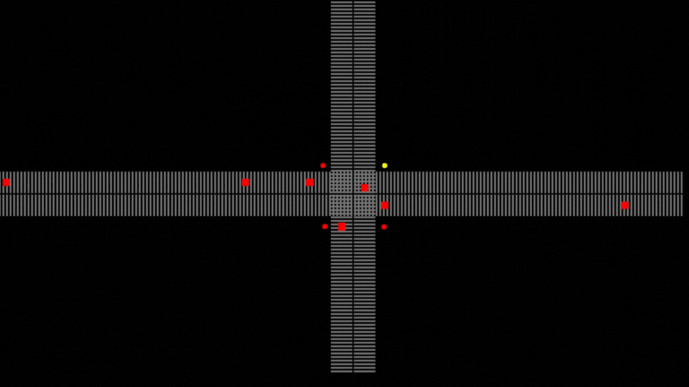

# Projeto Simulador de Tráfego 2D

> Projeto: Simulador de Tráfego 2D com Múltiplas Threads e Feedback Visual

Projeto desenvolvido por Arthur Covelo: um simulador bidimensional de tráfego urbano, implementado com programação concorrente utilizando múltiplas threads. 

Esse projeto se destaca pela aplicação de mecanismos de exclusão mútua, como semáforos e mutex, para garantir a sincronização adequada das operações.

Além disso, o simulador proporciona um feedback visual em tempo real, permitindo aos usuários observar a simulação do tráfego e as complexas interações entre os veículos em circulação.

A implementação é realizada em linguagem Java que inclui suporte threads e mecanismos de exclusão mútua (mutex e semáforo), ampliando a flexibilidade e possibilidades do projeto.

É válido ressaltar que o uso de bibliotecas gráficas, como o Swing, pode ser incorporado para enriquecer a experiência visual e interativa, tornando a simulação ainda mais envolvente e compreensível para os usuários.

## 🛠 Tecnologias

- Java
- Multi-Thread
- Git e Github

## 🖤 Contato

Arthurcovelo@gmail.com

[🔗 Clique aqui para acessar](https://arthurcovelo.github.io/ProjetoWeb_Profile/)
